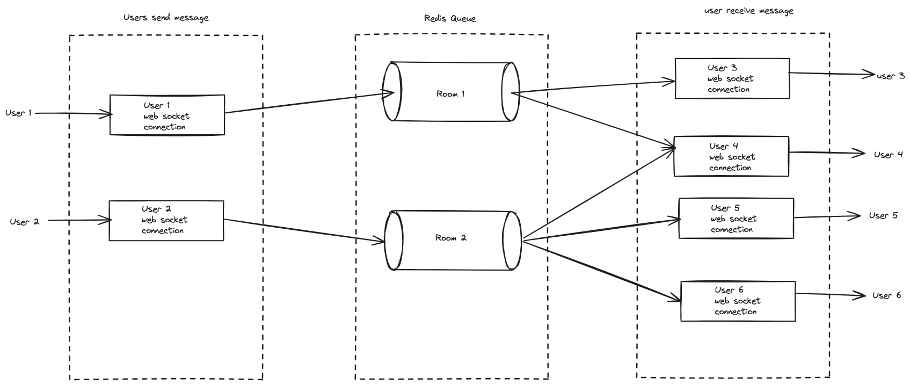

# ChatApplication
Backend Java Chat Application


## Pre-Requisite

   OS: MacOS or Ubuntu 21.04

   Project implemented using Java 17, Gradle 8.5

   Docker version 20.10.21 (pre-installed)

   Docker Compose version 2.14.0 (pre-installed)

   We use Postgresql, Redis as data storage


## High Level Design


### REST API
The Chat Application is made of two microservices. Although we mention another service it will be ignored to simplify the implementation and focus on the mandatory requirements.

* User Service: will handle all operations related to authentication, join and leave a chat group. This service will use a REST API. 
All users infos are stored in a postgres dabatase. User Service endpoints has the follwing endpoints

*** POST /users/subscribe, Join a group

***  POST /users/unsubscribe, Leave a group


* Chat Service: will handle all send and receive messages. This service will use a REST API. 
This service will use a message broker to synch messages between users and chat groups
this service will store messages in postgres sql.
User must always be authenticated to be able to call Chat Service endpoints. User Service endpoints has the following endpoints

***   POST /send, send messages to the chat

***   GET /messages, Retrieve all messages from a private or group discussion for a specified user

***   DELETE /messages/{id}, delete a message by a user

### WebSocket Services



In this diagram, we have the assumption that:
* user 1, user 3 & user 4 are in teh same chat room
* user 2, user 4, user 5 & user 6 are in teh same chat room

* when user 1  sends a message, the message is send to teh web socket server for user 1
* The message is published to room 1 channel that is shared between user 1 , user 3 & user 4
* Redis pub/sub will broadcast the message to all subscribers. In this case, the web socket connection handlers that holdsconnection for user 3 & user 4


## Application Endpoints

### User Service endpoints

  ``` sh
  POST /users/subscribe, Subscribe to a group

  POST /users/unsuscribe, unsubscribe to a group

  ```

  
### Chat Service endpoints
  
  ``` sh
   POST /api/chat/send, send a message a private or group discussion
  
   GET /api/chat/messages/{roomId}, Retrieve all messages from a room using the room id
   ```


## Configuration and Deployment

   Clone the project
   ``` sh
   git clone https://github.com/cnleng/ChatApplication.git
   ```

   Install docker & docker-compose MacOS (Using brew)
   ``` sh
   brew install docker
   brew install docker-compose
   ```

   Build and deploy project from command line using docker compose & docker. Make sure that ports 8080, 8082, 6379, 5432 are not in used.
   ``` sh
   cd ChatApplication
   docker-compose up --build -d
   ```

   Test an API call using credentials admin/dangerous (hardcoded values)
   ``` sh
         curl --location 'http://localhost:8082/api/chat/messages/1'  --data ''  -u admin:dangerous
   ```


   Tear down the project from command line using docker compose & docker
   ``` sh
   docker-compose down
   ```

## Room for Improvement

* Complete WebSocket implementation
* Implement a gateway service to handle authentication
* authentication must not use hard coded values
* API authentication
* Complete Unit tests
* Replace Postgres database with nosql database in Chat Services for scalabilty
* Externalize properties file used by both services and docker-compose file (Deployment will be more flexible) 