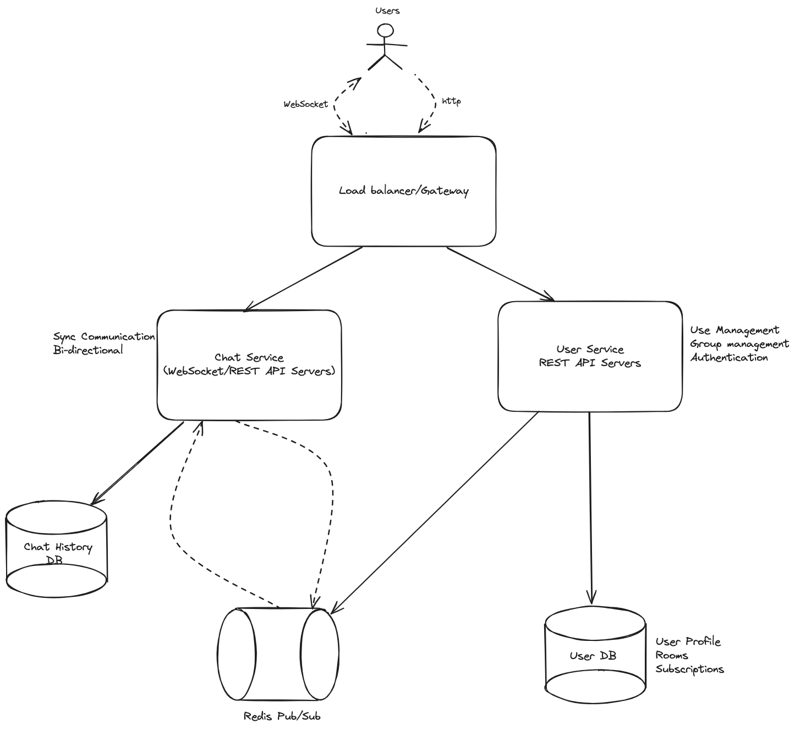

# ChatApplication
Backend Java Chat Application


## Pre-Requisite

   OS: MacOS or Ubuntu 21.04

   Project built using Java 17, Gradle 8.5

   Docker version 20.10.21

   Docker Compose version 2.14.0

   We use postgresql as our database storage


## High Level Design



The Chat Application is made of two services.
1- User Service: will handle all operations related to authentication, join and leave a chat group. This service will use a REST API. 
All users infos are stored in a postgres dabatase. User Service endpoints has the follwing endpoints
1.1 -  POST /join, Join a group
1.2 -  POST /leave, Leave a group
1.3 -  POST /authenticate, Authenticate to the Application


2 - Chat Service: will handle all send and receive messages. This service will use a REST API. 
This service will use a message broker to synch messages between users and chat groups
this service will store messages in postgres sql.
User must always be authenticated to be able to call Chat Service endpoints. User Service endpoints has the following endpoints
2.1 -  POST /send, send messages to the chat
2.2 -  POST /receive, Retrieve all messages from a private or group discussion for a specified user

## Application Endpoints

### User Service endpoints

  ``` sh
  POST /users/subscribe, Subscribe to a group

  POST /users/unsuscribe, unsubscribe to a group

  POST /users/authenticate,  Authenticate to the Application
  ```

  
### Chat Service endpoints
  
  ``` sh
   POST /chat/send, send a message a private or group discussion
  
   GET /chat/receive, Retrieve all messages from a private or group discussion
   ```


## Configuration and Deployment

   Clone the project
   ``` sh
   git clone https://github.com/cnleng/ChatApplication.git
   cd ChatApplication
   ```

   Build and deploy project from command line using docker compose & docker
   ``` sh
   docker-compose up --build -d
   ```
   Tear down the project from command line using docker compose & docker
   ``` sh
   docker-compose down
   ```


   ``` sh
      cd microservices/
   
      docker-compose up -d 
   ```